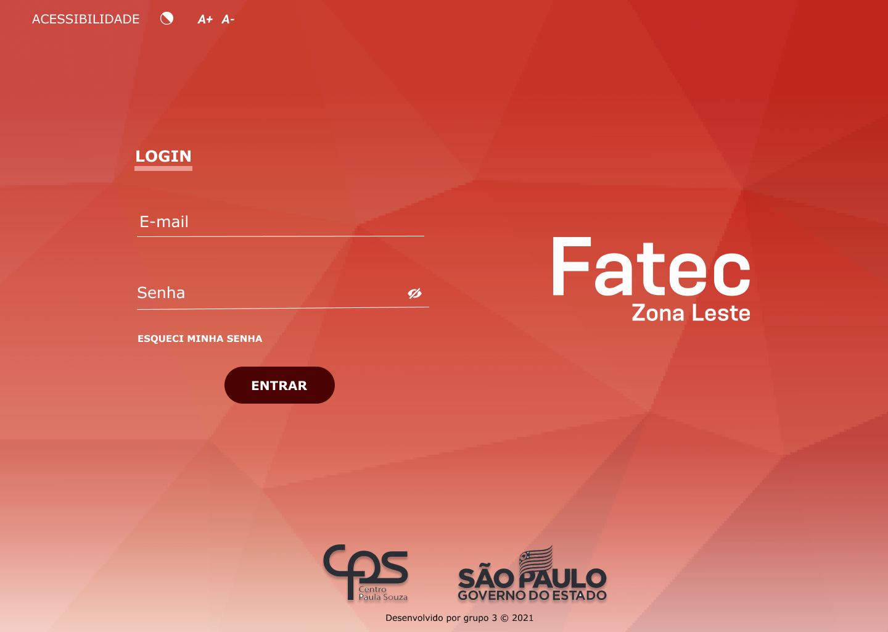

<h1 align=center>🏃🔥 Projeto Interdisciplinar - FATEC</h1>

O Projeto Interdiscplinar tem como premissa incentivar os alunos de Engenharia de Software Multiplataforma, a aplicar os conceitos e técnicas
adquiridos nas disciplinas durante os semestres, em busca de solucões e melhorias que realmente possam nos impactar e as pessoas que estão ao
nosso redor, com base nisso, os alunos poderiam escolher desenvolver um sistema apoiados em uma das seguintes opções:

- 1° Desenvolver soluções que agreguem aos sistemas/processos da FATEC Zona Leste;
- 2° Desenvolver soluções que ajudem microempreendedores a implantar o ambiente digital ao seu negócio. 

<b>Nosso grupo escolheu a primeira opção</b>; nos propusemos a desenvolver um sistema de Admissão de Professores.

  

  
<h2>👩‍🏫 Admissão de Professores</h2>

É um sistema que tem a finalidade de gerenciar e armazenar a documentação necessária no que diz respeito a admissão/readmissão de
professores da FATEC Zona Leste, visto que grande parte do processo atualmente é física e não é integrada, há uma grande perspectiva
de que a implantação adequada traga economias financeiras e reduza de forma significativa o tempo do processo de admissão/readmissão
dos professores.

  

 

<h2>👀 Visualização do projeto</h2>

Você pode visualizar as páginas do projeto através dos seguintes links:

- <a href="https://gldtra.github.io/Interdisciplinary_Project" target="_blank">Página Inicial</a>
- <a href="https://gldtra.github.io/Interdisciplinary_Project/cadastro.html" target="_blank">Cadastro</a>
- <a href="https://gldtra.github.io/Interdisciplinary_Project/anexo.html" target="_blank">Anexo</a>
- <a href="https://gldtra.github.io/Interdisciplinary_Project/consulta.html" target="_blank">Consulta</a>
- <a href="https://gldtra.github.io/Interdisciplinary_Project/acessibilidade.html" target="_blank">Acessibilidade</a>

 

<h2>📋 Sumário</h2>

- [Visão Geral](#introduction)
- [Sobre](#project)
- [Visualizar Páginas](#visualization)
- [Tecnologias](#technologies)
- [Layout](#layout)
- [Licença](#license) 

 

<h2>💡 Tecnologias Utilizadas</h2>

As seguintes tecnologias foram utilizadas no desenvolvimento do projeto <b>(até o momento)</b>:

- HTML5
- CSS3
- JavaScript
- jQuery

 

<h2>🔖 Layout</h2>

Você pode visualizar o layout do projeto através [desse link](https://www.figma.com/file/Mx5QBA1aI4zMtrXik2QcFN/Mockup-e-Wireframe---Desenvolvimento-Web?node-id=2%3A2). 
É necessário ter conta no [Figma](https://figma.com) para acessá-lo.

 

<h2>📝 Licença</h2>

Esse projeto está sob a licença MIT. Veja o arquivo [LICENSE](LICENSE) para mais detalhes.
